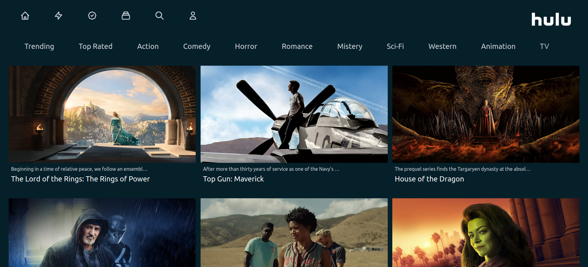
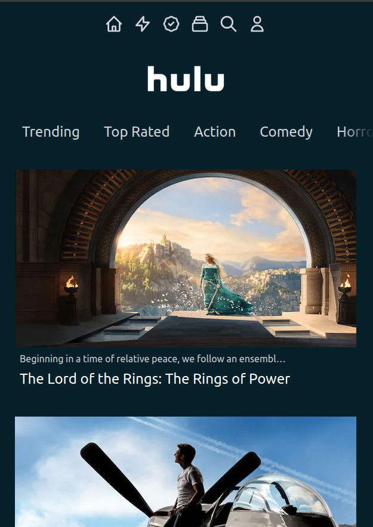

# Hulu clone - NextJS

This a clone of the main page of the streaming website "Hulu".

## Table of contents

- [Overview](#overview)
  - [Screenshot](#screenshot)
  - [Links](#links)
- [My process](#my-process)
  - [Built with](#built-with)
  - [What I learned](#what-i-learned)
  - [Useful resources](#useful-resources)
- [Miscellaneous](#miscellaneous)

### Screenshot

### Links

- Live site URL: [Live site at Vercel](https://hulu-clone-rkessal.vercel.app/)

## My process

### Built with

- NextJS
- Tailwind
- Flexbox / Grid
- Responsive Design

### What I learned

I learned how to fetch data from an API and manage the data, also how to navigate with the integrated router of NextJS. This is my second project using TailwindCSS.

### Useful resources
- [NextJS image lazy loading](https://nextjs.org/docs/basic-features/image-optimization)
- [Deploy a NextJS App](https://vercel.com/guides/deploying-nextjs-with-vercel)

## Miscellaneous

This documentation format was inspired by [correlucas](https://github.com/correlucas/)
